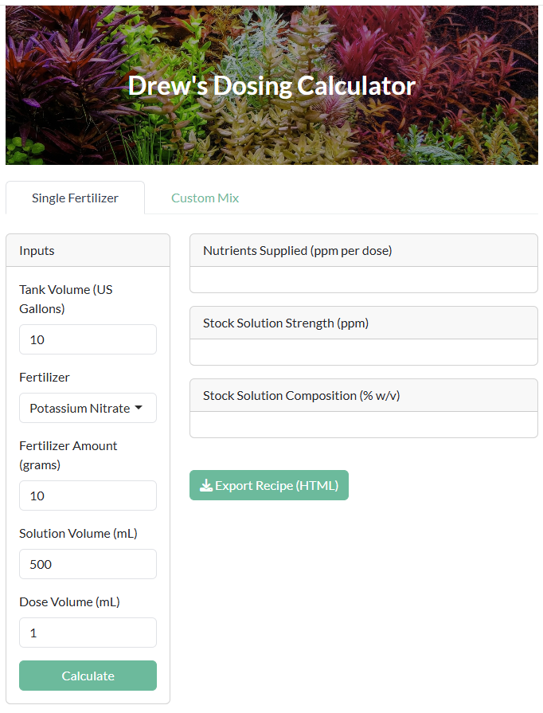

# Drew's Dosing Calculator

[🔗 Launch Live App: Click here to open Drew's Dosing Calculator](https://adwinters.shinyapps.io/drews-dosing-calculator/)  

Drew's Dosing Calculator is an interactive tool for calculating precise aquarium nutrient dosing. Users can either select a single fertilizer or create a custom mix of multiple fertilizers to determine how much each nutrient (N, P, K, Mg, Ca, S, and trace elements) is supplied per dose, the concentration in stock solutions (ppm), and the percentage composition (% w/v). The app converts tank volumes from gallons to liters, allows specification of stock solution and dosing volumes, dynamically generates nutrient tables, and provides a downloadable HTML recipe with all calculations.

---

## How It Works

The app calculates:

- **Stock solution concentration (ppm):** based on the amount of fertilizer and solution volume.  
- **Tank increase per dose (ppm):** how much each nutrient increases in your tank.  
- **Stock % w/v:** the weight/volume percentage of each nutrient in the solution.

It uses known nutrient percentages for each fertilizer to provide accurate results.

---

## Features

- Two modes: **Single Fertilizer** or **Custom Mix**  
- Calculates contributions for major nutrients (N, P, K, Mg, Ca, S) and trace elements (Fe, Mn, Zn, Cu, B, Mo, Cl)  
- Generates a downloadable HTML recipe showing tank volume, solution composition, dose, and nutrient breakdown  
- Clean, responsive interface built with Shiny and Bootstrap 5  

---

## Supported Fertilizers

| Abbreviation | Name |
|-------------|------|
| KNO3        | Potassium Nitrate |
| KH2PO4      | Potassium Phosphate |
| K2SO4       | Potassium Sulfate |
| MgSO4·7H2O  | Magnesium Sulfate Heptahydrate |
| CaSO4·2H2O  | Calcium Sulfate Dihydrate |
| CaCl2       | Calcium Chloride |
| (NH4)2SO4   | Ammonium Sulfate |
| CO(NH2)2    | Urea |
| CSM+B       | NilocG trace mix |

---

## Why This Matters

Precise nutrient dosing is essential for a thriving planted aquarium.  
Too little can starve your plants of key nutrients, while too much can upset water chemistry and promote algae growth.  
This calculator helps you add exactly what your plants need, taking the guesswork out of fertilization.

---

## Screenshot

---

## Built With

- [R](https://www.r-project.org/)  
- [Shiny](https://shiny.rstudio.com/)  
- [bslib](https://rstudio.github.io/bslib/) for theming  
- [htmltools](https://cran.r-project.org/web/packages/htmltools/index.html) for exporting recipes
